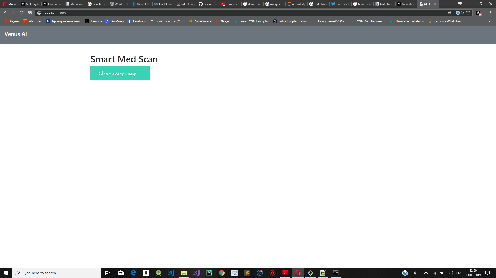
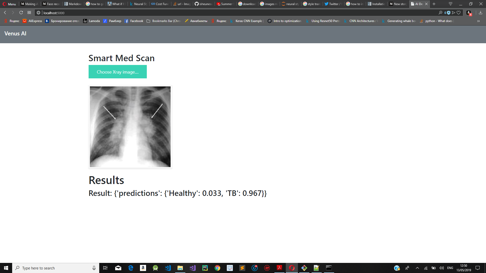
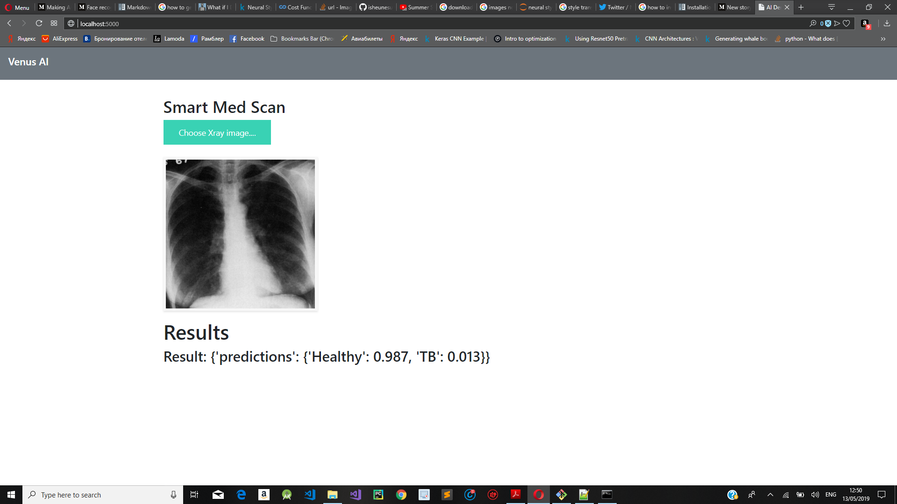

# TB Computer AIded Diagnosis Using Deep Learning

According to Who about a quarter of the world's population is infected by TB bacteria  and a small proportion of those infected will become sick with TB.WHO aims at reducing TB deaths by 90% and to cut new cases to 80% between 2015 and 2030 ,therefore they is need for automated systems to help doctors detect TB from chest X-ray images. The computer aided system uses is a resnet50 model which was trained from TB x-ray and deployed to a flask api. The model has an accuracy of 81% which is not bad considering the data used was little. Convolutional Neural Networks are good at identifying patterns thus can learn how to distiguish between TB infected X-ray images and not infected. 

 Make sure you have the following dependencies before running the web app

<ul>

<li>Flask</li>
<li>Tensorflow</li>
<li>Keras

<li>Numpy

<li>PIL

Scipy

</ul>

Resnet Model  

https://drive.google.com/file/d/16Dkn9dp5EVr8TZTv3Xd9JIXw_A_YmhDg/view?usp=sharing

Paper on ResNet50

https://arxiv.org/abs/1512.03385

To run the web app use on port 5000 

 python app.py 

